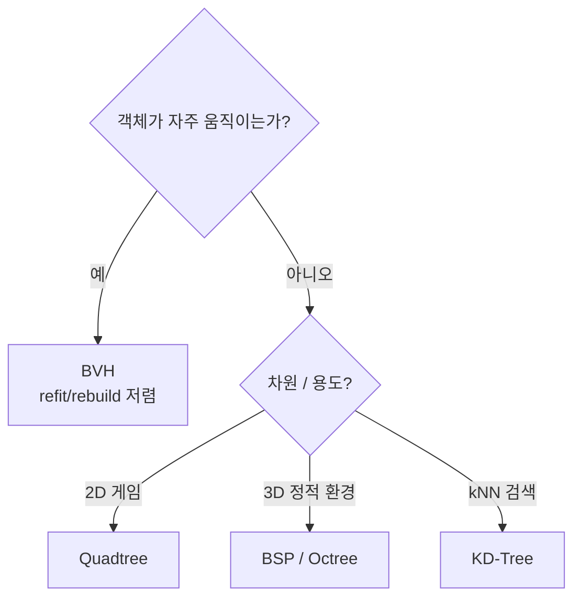

# 공간 분할 (Spatial Partitioning)

## 개요

N개 객체 간 충돌·시야·근접 질의를 단순 비교하면 O(N²)이 된다.
공간을 미리 분할해 두면 "내 근처 객체만" 빠르게 추리는 게 가능해 O(N log N) 이하로 떨어진다.
**렌더링 컬링**, **물리 broad-phase**, **AI 인지 범위 질의** 모두 같은 자료구조를 공유한다.

## 핵심 비교

| 구조 | 차원 | 정적/동적 | 핵심 특징 |
| --- | --- | --- | --- |
| **Uniform Grid** | 2D/3D | 둘 다 | 균등 셀, 객체 분포 균일할 때 최적 |
| **Quadtree** | 2D | 정적·반동적 | 4분할 재귀, 객체 밀도 불균등에 유리 |
| **Octree** | 3D | 정적·반동적 | 8분할, 3D 컬링·LOD |
| **BVH** | 3D | 동적 | 객체 단위 AABB 트리, 잦은 갱신에 적합 |
| **BSP** | 2D/3D | 정적 | 평면으로 공간 양분, 실내 정적 환경 |
| **KD-Tree** | k차원 | 정적 | 축별 분할, 최근접 이웃(kNN) 검색 |



### 언제 무엇을?

- **실시간 동적 충돌(캐릭터, 발사체)** — BVH (refit 비용 작음) 또는 Spatial Hash
- **정적 레벨 지오메트리** — BSP 또는 Octree
- **2D 탑다운/사이드뷰** — Quadtree
- **렌더링 frustum culling** — Octree + 객체별 AABB
- **AI 시야 내 가장 가까운 적 N명** — KD-Tree

## 구현 핵심

### BVH (Bounding Volume Hierarchy)

- 리프 = 객체 AABB, 내부 노드 = 자식 노드 AABB의 합집합
- **빌드**: SAH(Surface Area Heuristic)로 분할 비용 최소화
- **갱신**: 객체 이동 시 리프 AABB만 갱신 → 부모로 전파(refit). 큰 변화면 재빌드
- Unreal의 PhysX/Chaos는 broad-phase에 BVH 사용

### Octree

- 큐브를 8개 자식으로 균등 분할
- 객체는 자신을 완전히 포함하는 가장 작은 노드에 저장 (또는 여러 자식에 걸치면 부모에 보관)
- 최대 깊이 또는 객체 수 임계로 분할 중단

## C++ 예시

```cpp
// 간이 BVH 노드
struct FBVHNode
{
    FBox Bounds;
    int32 LeftChild = INDEX_NONE;
    int32 RightChild = INDEX_NONE;
    int32 PrimitiveIndex = INDEX_NONE; // 리프일 때만 유효
    bool IsLeaf() const { return PrimitiveIndex != INDEX_NONE; }
};

void QueryOverlap(const TArray<FBVHNode>& Nodes, int32 NodeIdx,
                  const FBox& Query, TArray<int32>& OutHits)
{
    const FBVHNode& N = Nodes[NodeIdx];
    if (!N.Bounds.Intersect(Query)) return;
    if (N.IsLeaf()) { OutHits.Add(N.PrimitiveIndex); return; }
    QueryOverlap(Nodes, N.LeftChild, Query, OutHits);
    QueryOverlap(Nodes, N.RightChild, Query, OutHits);
}
```

리프가 아닌 노드는 박스 교차 검사로 가지치기. 트리 깊이가 ~log N이므로 질의가 빠르다.

## 면접/실무 포인트

- **Q1**: 동적 BVH의 refit vs rebuild는 언제 선택하나? — 객체 이동량이 누적되면 트리 품질이 나빠진다. **SAH 비용이 임계 이상이면 재빌드**, 아니면 refit.
- **Q2**: Octree에서 객체가 여러 자식에 걸치면? — 분할하지 않고 부모에 두는 게 일반적. 객체가 매우 크면 트리 효율 저하 → loose octree 등 변형.
- **Q3**: Unreal의 World Partition은 어떤 자료구조에 가까운가? — Grid 기반(Cell). Octree보다 단순하지만 메모리 스트리밍과 잘 맞는다.
- **Q4**: BSP가 옛 FPS(Quake)에서 잘 맞은 이유? — 정적 실내 + 가시성 계산(PVS) 친화. 동적 객체 많은 현대 게임엔 부적합.

## 심화 학습

- SAH(Surface Area Heuristic)와 트리 품질 지표
- Loose Octree, Sparse Voxel Octree
- Spatial Hashing (해시로 셀 ID 매핑)
- 관련 페이지: [충돌 연산](collision.md), [Draw Call](../04-computer-architecture/draw-call.md)
