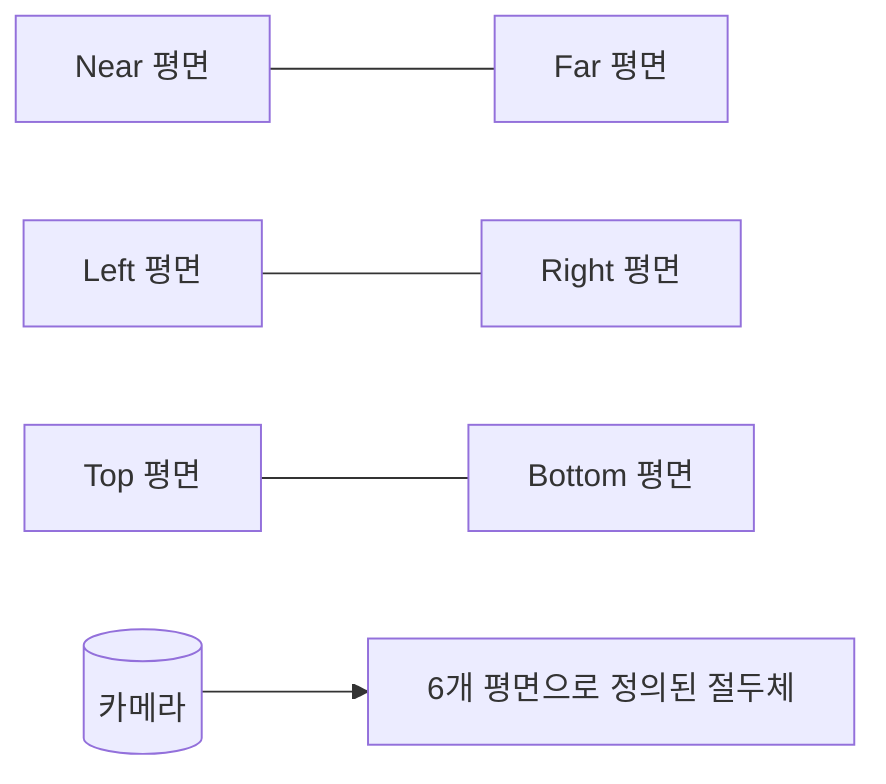

# 시야각 & 백페이스 컬링

## 개요

화면에 안 보이는 것을 그리는 비용은 모두 낭비다.
**보이지 않을 가능성이 높은 객체를 빠르게 제외**하는 것이 모든 컬링의 목표.
세 단계로 나누어 적용한다: Frustum → Backface → Occlusion.

## 핵심 개념

### 컬링 단계

| 단계 | 무엇을 제거 | 비용 |
| --- | --- | --- |
| **Frustum Culling** | 카메라 시야 밖 객체 | 객체 단위, CPU/GPU |
| **Backface Culling** | 카메라 반대편 향한 삼각형 | 정점 셰이더 후, GPU 고정 |
| **Occlusion Culling** | 시야 안이지만 가려진 객체 | 비싸지만 효과 큼 |

### View Frustum



- 6개 평면(near/far/left/right/top/bottom)으로 정의되는 절두체
- 객체의 AABB(또는 bounding sphere)가 6평면 **모두에 대해 안쪽**이면 시야 내
- 한 평면이라도 완전히 바깥이면 제외

### 평면-AABB 검사

평면 방정식 `Ax + By + Cz + D = 0`에서:

- 평면 법선 방향으로 AABB의 **가장 먼 점**이 평면 바깥이면 완전히 바깥 → 제외
- 한 번에 6평면 모두 검사 → 정수 비교 6번

### 백페이스 컬링

- 삼각형 정점 순서(winding: CCW vs CW)로 면의 향하는 방향 결정
- 카메라 → 삼각형 방향 벡터와 삼각형 법선의 내적 부호로 판정
- **부호 < 0이면 카메라를 향함 (그린다)**, > 0이면 뒤를 향함 (버린다)
- GPU 래스터라이저가 고정 기능으로 처리 (`D3D12_RASTERIZER_DESC::CullMode`, OpenGL `glCullFace`)
- 약 절반의 삼각형을 픽셀 셰이딩 전에 제거

### Occlusion Culling

- 다른 객체에 완전히 가려진 것을 미리 제외
- 대표 기법:
    - **PVS (Potentially Visible Set)** — 정적 환경 사전 계산, 옛 FPS의 BSP와 함께
    - **HZB (Hierarchical Z-Buffer)** — 저해상도 depth로 occluder 비교 (Unreal 사용)
    - **Software Rasterizer Occlusion** — CPU에서 거친 깊이 그리기 후 비교
    - **GPU Occlusion Query** — 한 프레임 지연, 작은 객체에 부적합

## C++ 예시

### 평면-AABB 컬링

```cpp
// 평면: Normal·P + D = 0
struct FPlane2 { FVector N; float D; };

bool IsAABBInside(const FBox& Box, const TArray<FPlane2>& FrustumPlanes)
{
    for (const FPlane2& P : FrustumPlanes)
    {
        // AABB에서 평면 법선 방향으로 가장 먼 점
        const FVector Positive(
            P.N.X >= 0 ? Box.Max.X : Box.Min.X,
            P.N.Y >= 0 ? Box.Max.Y : Box.Min.Y,
            P.N.Z >= 0 ? Box.Max.Z : Box.Min.Z);

        if (FVector::DotProduct(P.N, Positive) + P.D < 0)
        {
            return false; // 평면 바깥 → 컬링
        }
    }
    return true;
}
```

Unreal에서는 `FConvexVolume::IntersectBox` 등이 동일 역할.

### Unreal HZB 옵션

```cpp
// 프로젝트 세팅 또는 ini
// r.HZBOcclusion=1  // 기본 활성
// r.Visibility.HZBOcclusionScreenSize=0.025
```

- 작은 객체일수록 HZB의 효율이 높다 (개별 쿼리보다 묶음 처리)

## 심화 학습

- Plane equation 부호 규약과 평면 정규화
- Hierarchical culling (Octree + per-object AABB)
- GPU-driven rendering pipeline (Indirect Draw, mesh shader)
- 관련 페이지: [공간 분할](../01-data-structures/space-partitioning.md), [Draw Call](../04-computer-architecture/draw-call.md), [배경 최적화](../04-computer-architecture/environment-optimization.md)
