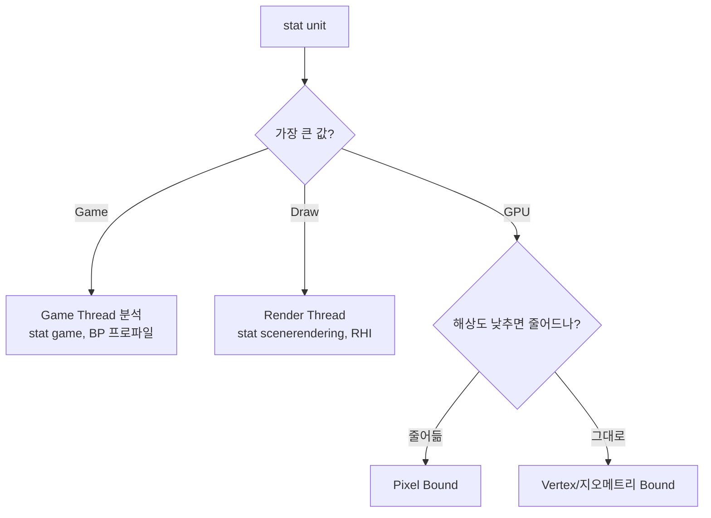

# 병목 현상 최소화

## 개요

"느려요"는 문제 진술이 아니다. **어느 스레드가, 어느 단계에서, 왜 느린지** 측정한 뒤에야 고칠 수 있다.
"측정 없는 최적화는 도박" — 추측 기반 최적화는 잘못된 곳을 만지거나, 빠른 곳을 더 빠르게 만드느라 시간 낭비.

## 핵심 개념

### stat unit 읽기

Unreal에서 `stat unit` 입력 시 한 줄로 표시:

```
Frame: 18.2 ms  Game: 6.1 ms  Draw: 12.4 ms  GPU: 17.8 ms
```

- **Frame** = 실제 한 프레임에 걸린 시간 (= max 가까움, 파이프라이닝 영향)
- **Game** = Game Thread (Tick, AI, 물리 큐잉)
- **Draw** = Render Thread (visibility, command 준비)
- **GPU** = GPU 시간

**가장 큰 값이 곧 1차 병목**. 위 예시는 GPU bound.

### 병목 유형별 대응

| 병목 | 판별 | 1차 대응 |
| --- | --- | --- |
| **Game Thread** | Game 값이 가장 큼 | Tick 분산, BP 로직 → C++, async 활용 |
| **Render Thread** | Draw 값이 가장 큼 | 드로우콜 감소, Batching, Instancing |
| **GPU - Vertex** | 폴리곤 많고 픽셀 적을 때 | LOD, Nanite, 비주얼 단순화 |
| **GPU - Pixel** | 해상도 크고 셰이더 복잡 | r.ScreenPercentage 낮춤, 머티리얼 단순화 |
| **GPU - Bandwidth** | 텍스처·post-process 많음 | 텍스처 압축, 포스트 줄임 |

### 진단 흐름



해상도 절반(`r.ScreenPercentage 50`)에도 GPU 시간이 그대로면 vertex/지오메트리 bound.
줄어들면 pixel bound.

## C++ 예시: Tick 분산

```cpp
// 매 프레임 모든 NPC가 시야 검사를 하면 N×M 비용
void ANPC::Tick(float Dt)
{
    Super::Tick(Dt);
    UpdateAI(Dt); // 매 프레임
}

// 개선: 그룹 단위 시간 슬라이싱
void ANPC::Tick(float Dt)
{
    Super::Tick(Dt);
    if (GFrameNumber % AIUpdatePeriod == AIBucketIndex)
    {
        UpdateAI(Dt * AIUpdatePeriod);
    }
}
```

- 시야 검사·길찾기는 매 프레임 불필요
- 군중을 N개 버킷으로 나눠 라운드로빈

### Significance Manager

Unreal `USignificanceManager`로 거리·각도에 따라 Tick 주기를 자동 조절.

## 도구

| 도구 | 용도 |
| --- | --- |
| **stat unit / stat unitgraph** | 1차 병목 판단 |
| **Unreal Insights** | 타임라인, 함수별 시간 |
| **RenderDoc** | 프레임 캡처, 패스별 GPU 시간 |
| **PIX (Windows DX12)** | GPU 워크로드 상세 |
| **NVIDIA Nsight** | GPU 깊이 분석 |
| **Tracy** | 가벼운 in-process |
| **Superluminal** | 샘플링 프로파일러 |

자세한 사용법은 [프로파일링 & 최적화 도구](../10-profiling/index.md).

## 면접/실무 포인트

- **Q1**: Game Thread가 병목일 때 BP → C++ 전환이 답인가? — BP 자체보다 **Tick 빈도와 알고리즘 복잡도**가 더 큰 요인. BP가 핫패스에 있으면 C++ 이전 효과 있음.
- **Q2**: GPU bound에서 해상도를 낮추는 게 항상 정답? — pixel bound면 효과 큼, vertex bound면 거의 무효. 먼저 어느 쪽인지 확인.
- **Q3**: Multi-thread Render Thread (Parallel Rendering) 효과? — DX12/Vulkan에서 command buffer를 여러 스레드가 동시 작성. Render Thread 단일 코어 병목 완화.
- **Q4**: Overdraw가 뭐고 어떻게 측정? — 같은 픽셀을 여러 번 그리는 비용. RenderDoc, ViewMode `ShaderComplexity`로 시각화. 반투명 폴리지·파티클이 주범.
- **Q5**: VSync가 켜진 상태에서의 측정 함정? — 실제 비용보다 좋게 보임(상한이 16.6ms). 측정 시 VSync 끄거나 unlocked framerate.

## 안티패턴

- "최적화 책 읽고 모든 곳에 inline·SIMD" — 측정 없이 한 변화는 회귀
- "느리니까 백엔드를 갈아엎자" — 정작 병목은 한 함수의 잘못된 알고리즘
- `stat unit` 한 번 보고 결론 — 입력·상황(전투 중, 도시 한가운데)에 따라 병목 달라짐. 여러 시나리오 측정 필요

## 심화 학습

- Top-down performance analysis (Intel)
- Frame Pacing, Variable Refresh Rate
- 관련 페이지: [프로파일링 & 최적화 도구](../10-profiling/index.md), [Draw Call](draw-call.md), [메인/렌더/물리 분리](../05-threading/render-physics-split.md)
