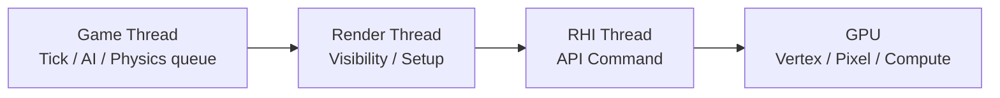

# 4. 컴퓨터 아키텍처

## 개요

게임 한 프레임은 **Game Thread → Render Thread → RHI Thread → GPU**의 파이프라인을 거친다.
어느 단계가 가장 느리냐가 전체 프레임 시간을 결정한다 — **가장 느린 단계가 곧 병목**.
이 섹션은 그 파이프라인을 이해하고, **Draw Call**·**병목 분석**·**배경 최적화** 세 가지 핵심 주제로 들어간다.

## 한 프레임 파이프라인

- 각 스레드는 1프레임씩 지연 가능 (Unreal 기본 동작)
- 게임 로직 → 다음 프레임 렌더링 → 또 다음 프레임 GPU 출력
- → 입력 지연을 줄이고 싶으면 `r.OneFrameThreadLag` 조정

## 이 섹션에서 다루는 것

| 주제 | 핵심 |
| --- | --- |
| [Draw Call](draw-call.md) | API 호출 비용, Batching, Instancing, Nanite |
| [병목 현상 최소화](bottleneck.md) | CPU vs GPU bound 판별, stat unit 해석 |
| [배경 최적화](environment-optimization.md) | HLOD, World Partition, Streaming, Lumen |

## CPU vs GPU 책임

| 영역 | CPU | GPU |
| --- | --- | --- |
| 게임 로직, AI | O | — |
| 물리 시뮬레이션 | O (PhysX/Chaos) | 일부 (cloth/fluid) |
| 컬링·정렬 | O (GPU-driven은 일부 GPU) | — |
| 정점·픽셀 셰이딩 | — | O |
| 포스트 프로세스 | — | O |
| Compute (라이트, GI) | — | O |

## 병목의 종류

| 병목 | 증상 | 1차 대응 |
| --- | --- | --- |
| **CPU bound (game thread)** | 적은 객체에도 프레임 저하 | 로직 최적화, Tick 분산 |
| **CPU bound (render thread)** | 드로우콜 많고 객체 많음 | Batch, Instance, 컬링 |
| **GPU bound (vertex)** | 폴리곤 수 많음, Nanite 비활성 | LOD, Nanite |
| **GPU bound (pixel)** | 고해상도, 오버드로우 | 해상도 스케일, 머티리얼 단순화 |
| **GPU bound (memory bandwidth)** | 텍스처 큼, post-process 많음 | 텍스처 압축, 해상도 조정 |

`stat unit` 한 줄이 어느 스레드가 병목인지 알려준다 — 자세한 건 [병목 현상 최소화](bottleneck.md).

## 심화 학습 키워드

- GPU-driven rendering, Mesh Shader
- Pipeline State Object (PSO) 캐시
- DX12 Bindless, Vulkan descriptor indexing
- 관련 페이지: [프로파일링 도구](../10-profiling/index.md), [스레드 분리](../05-threading/render-physics-split.md)
