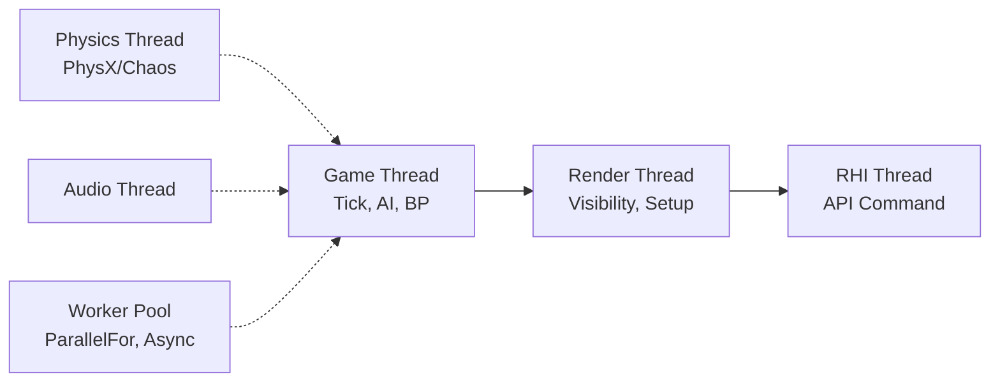

# 5. 스레드 & 동기화

## 개요

게임은 한 프레임 16.6ms 안에 입력·AI·물리·렌더링·오디오·네트워크를 모두 처리해야 한다.
단일 스레드로는 불가능한 작업량이라 **메인/렌더/물리/RHI/Worker** 스레드로 나누고, **Task Graph** 같은 병렬 디스패치를 활용한다.
동시에 동기화는 **lock-free 우선, 락 최소화, 데이터 분리 우선**이 원칙.

## 이 섹션에서 다루는 것

| 주제 | 핵심 |
| --- | --- |
| [멀티스레딩 기초](multi-threading.md) | race condition, lock, atomic, lock-free |
| [메인/렌더/물리 분리](render-physics-split.md) | Unreal 스레드 파이프라인, 1프레임 지연 |
| [병렬 처리](parallel-processing.md) | Task Graph, ParallelFor, Job System |

## 게임 엔진 표준 스레드 모델

- 각 스레드는 자기 작업 후 다음 스레드에 데이터 전달
- Game ↔ Render는 1프레임 지연이 일반적 (latency vs throughput)
- Worker 풀은 데이터 병렬(ParallelFor) 또는 비동기 잡(IO, 길찾기, 절차 생성)

## 동기화 도구 스펙트럼

| 도구 | 비용 | 사용 |
| --- | --- | --- |
| **데이터 분리 (스레드 로컬)** | 0 | 가능하면 최우선 |
| **atomic** | 매우 낮음 | 단일 값 카운터·플래그 |
| **lock-free queue** | 낮음 | producer/consumer |
| **mutex / FCriticalSection** | 중간 | 공유 자원 |
| **RW lock** | 다소 비싸지만 다중 read | 다수 read, 소수 write |
| **named semaphore** | 비쌈 | 프로세스 간 |

**가장 좋은 락은 락이 없는 것** — 데이터를 분리할 수 있으면 우선 분리.

## 면접 빈출 주제

- "race condition을 어떻게 디버깅?" → 재현성 확보(deterministic seed, replay), TSan
- "Game Thread에서 무거운 일을 Worker로 옮길 때 위험은?" → UObject 접근 규칙, GC와의 충돌
- "deadlock 진단법?" → 락 획득 순서 통일, 디버거 스레드별 콜스택, deadlock detector

## 안티패턴 미리보기

- "동기화 빠지면 락부터" — 종종 atomic이면 충분하거나 데이터 분리로 락 자체 회피 가능
- "ParallelFor에서 같은 컨테이너 push_back" — race, false sharing 동시 발생
- Game Thread에서 무거운 IO/네트워크 → 메인 스레드 정지

## 심화 학습 키워드

- Memory ordering (acquire, release, seq_cst)
- Hazard pointer, RCU
- Work-stealing scheduler
- 관련 페이지: [캐시 메모리](../03-cache-memory/index.md), [OS 스케줄링](../07-os-scheduling/index.md)
