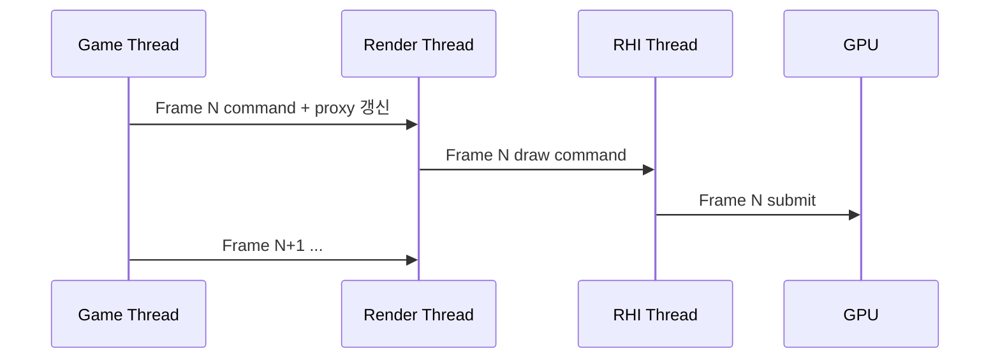

# 메인/렌더/물리 분리

## 개요

게임 한 프레임을 **Game Thread → Render Thread → RHI Thread → GPU**로 파이프라인 분할하면,
각 스레드가 다음 프레임 작업을 미리 시작해 단일 스레드 대비 처리량이 크게 늘어난다.
대신 **입력에서 화면까지의 지연(latency)은 1~2 프레임 늘어난다** — 처리량과 지연의 트레이드.

## 핵심 개념

### Unreal 스레드 파이프라인



- Game Thread: Tick, AI, BP, 물리 큐잉
- Render Thread: visibility, scene proxy 처리, draw command 생성
- RHI Thread: 그래픽스 API 호출(DX12/Vulkan command list)
- GPU: 실제 픽셀 출력

**한 프레임 지연**: Game이 만든 데이터가 Render에 도착, 그 다음 프레임에 GPU. `r.OneFrameThreadLag=0`으로 끄면 지연 줄지만 throughput↓.

### Physics Thread

- PhysX/Chaos는 자체 스레드에서 동작
- Game Thread는 입력만 큐잉(force, impulse) → 결과를 다음 tick에 받음
- → 물리 결과 기반 로직은 다음 프레임 처리 (1 프레임 지연)

### Audio Thread

- 오디오 콜백은 OS 우선순위 높은 별도 스레드
- Game Thread가 늦어도 오디오 끊김 회피
- 게임 데이터 → 오디오 스레드 통신은 lock-free 큐

### GameThread-only API

Unreal에서 대부분의 `UObject` 접근, BP 실행, 액터 스폰은 **Game Thread만 허용**.
워커 스레드에서 `GetWorld()->SpawnActor` 호출 시 크래시 또는 정의되지 않은 동작.

→ 워커에서 한 결과는 Game Thread로 디스패치(예: `AsyncTask(ENamedThreads::GameThread, ...)`).

## C++ 예시

### Render Command 큐잉

```cpp
// Game Thread에서 Render Thread에 명령 보내기
ENQUEUE_RENDER_COMMAND(UpdateMyResource)(
    [Resource = MyResource, Data = NewData](FRHICommandListImmediate& RHICmdList)
    {
        // 이 블록은 Render Thread에서 실행
        Resource->Update(Data, RHICmdList);
    }
);
```

람다 캡처에 주의: Game Thread에서 캡처한 객체의 수명이 Render Thread 실행 시점까지 유지돼야 함.

### Worker → Game Thread 결과 전달

```cpp
// 무거운 계산은 워커에서
AsyncTask(ENamedThreads::AnyBackgroundThreadNormalTask, [this]()
{
    const FResult R = HeavyCompute();

    // UObject 접근은 Game Thread로 복귀
    AsyncTask(ENamedThreads::GameThread, [this, R]()
    {
        ApplyResult(R);
    });
});
```

WeakPtr/Weak Object Pointer로 객체 수명 확인 후 적용.

## 면접/실무 포인트

- **Q1**: 1프레임 지연이 왜 입력감을 떨어뜨리는가? — 입력 받은 시점과 화면에 반영되는 시점이 16.6ms 이상 차이. 60Hz면 약 33ms 입력 지연.
- **Q2**: 모든 작업을 Game Thread에서 직렬화하면 안 되나? — 코어 1개만 사용 → 처리량 절반 이하. 멀티코어 CPU 활용 불가.
- **Q3**: 워커에서 `UObject` 접근 시 어떻게 우회? — 가벼운 POD struct로 데이터 추출 후 워커가 처리, 결과를 Game Thread로 복귀. 또는 weak pointer + 메인에서 dereference.
- **Q4**: Render Thread가 Game Thread를 한 프레임 따라가지 못하면? — Game Thread가 다음 프레임 시작을 대기(stall). Game이 너무 빨라도 문제, Render가 너무 느려도 문제 — 균형이 중요.
- **Q5**: Physics 결과를 받는 시점이 1프레임 늦어 부자연스러우면? — Sub-step 늘리거나(Chaos), 클라이언트 예측처럼 즉시 시각 보정 후 결과 도착 시 보정.

## 안티패턴

- Game Thread에서 동기 IO/네트워크 → 메인 스레드 정지, 프레임 드랍
- 워커 스레드에서 `UWorld`/`AActor` 직접 만지기 → crash
- 매 프레임 Render Command를 수천 개 큐잉 → Render Thread 대기열 폭증

## 심화 학습

- Frame pacing과 v-sync 상호작용
- DX12 multi-thread command list 작성
- Mobile thermal throttling에서의 스레드 분배
- 관련 페이지: [멀티스레딩 기초](multi-threading.md), [병렬 처리](parallel-processing.md), [병목 현상 최소화](../04-computer-architecture/bottleneck.md)
