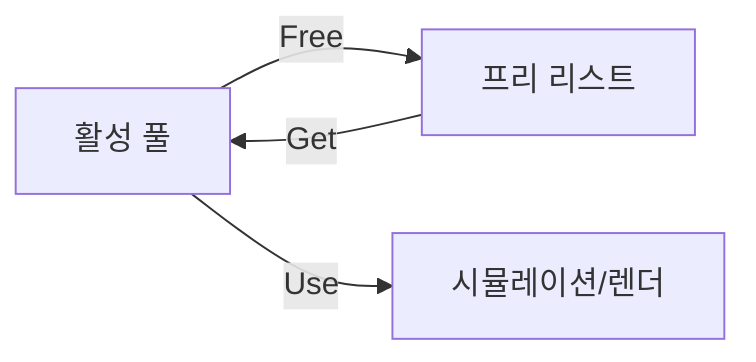

# 6. 동적 할당 & 단편화

## 개요

`new`/`malloc`은 보기보다 비싸다.
시스템 호출, 락, 자유 리스트 탐색, 단편화 정리 — 일반 목적 allocator는 안전하지만 **게임의 tight loop에는 부적합**.
게임은 **메모리 풀**, **arena**, **stack allocator** 등 **사용 패턴에 특화된 할당기**를 함께 쓴다.

## 핵심 개념

### 단편화 (Fragmentation)

| 종류 | 원인 |
| --- | --- |
| **외부 단편화** | 자유 메모리 총량은 충분한데 연속된 큰 블록이 없음 |
| **내부 단편화** | 할당 단위가 요청보다 큼 (정렬·헤더 오버헤드) |

장시간 가동되는 서버·MMO에서 특히 치명적.

### 게임용 Allocator 카탈로그

| Allocator | 특징 | 사용처 |
| --- | --- | --- |
| **Pool** | 고정 크기 블록 풀, 할당 O(1) | 총알, 이펙트, 노드 |
| **Arena (Bump)** | 단조 증가, 일괄 해제 | 한 프레임/한 레벨 수명 |
| **Stack** | LIFO, 함수 스코프 임시 | 일시적 배열 |
| **Slab** | 크기 등급별 풀 모음 | 커널 스타일 일반 목적 |
| **Buddy** | 2의 거듭제곱 블록, 분할/병합 | 큰 블록 + 단편화 완화 |
| **TLSF (Two-Level Segregated Fit)** | O(1) 일반 allocator | 실시간 시스템 |

### Object Pool



- 미리 N개 객체 생성 → 사용 시 풀에서 가져옴, 해제 시 풀로 반납
- `new`/`delete` 회피 + 캐시 친화(연속 메모리)
- 총알·발자국 데칼·파티클·길찾기 노드의 표준

## C++ 예시

### Object Pool

```cpp
template <typename T, int32 Capacity>
class TObjectPool
{
    TArray<T> Storage;            // T를 연속 메모리에 보관
    TArray<int32> FreeList;       // 인덱스 자유 리스트

public:
    TObjectPool()
    {
        Storage.SetNum(Capacity);
        FreeList.Reserve(Capacity);
        for (int32 i = Capacity - 1; i >= 0; --i) FreeList.Add(i);
    }

    T* Acquire()
    {
        if (FreeList.Num() == 0) return nullptr;
        const int32 Idx = FreeList.Pop(EAllowShrinking::No);
        return &Storage[Idx];
    }

    void Release(T* Ptr)
    {
        const int32 Idx = Ptr - Storage.GetData();
        FreeList.Add(Idx);
    }
};
```

`Acquire`/`Release`가 O(1). `Storage`가 연속이라 순회 시 캐시 친화.

### Unreal: FMemStack (스레드 로컬 arena)

```cpp
// 한 함수 스코프 동안만 사는 임시 메모리
FMemMark Mark(FMemStack::Get());
TArray<int32, TMemStackAllocator<>> Temp;
Temp.Reserve(1000);
for (int32 i = 0; i < 1000; ++i) Temp.Add(i);
// 함수 종료 시 Mark 소멸자가 일괄 해제
```

`malloc`/`free` 호출 0회. 매 프레임 사용해도 단편화 없음.

### TArray 미리 Reserve

```cpp
TArray<FVector> Points;
Points.Reserve(ExpectedCount); // 미리 한 번만 할당
for (...) Points.Add(P);
```

- `Reserve` 없이 `Add`를 반복하면 내부적으로 배열 재할당 + 복사 발생
- 게임 핫패스에서는 `Reserve` 또는 `SetNum`으로 사전 할당

## 메모리 풀 라이프사이클

1. **사전 할당** — 게임 시작/레벨 로드 시 풀 생성
2. **사용** — `Acquire`로 가져와 활성화 (위치·상태 초기화)
3. **반환** — `Release`로 자유 리스트 복귀, 활성 객체 비활성화
4. **시각화** — 비활성 객체는 hidden + collision off

## 안티패턴

- 매 프레임 `TArray::Add`만 호출 (Reserve 없음) → 재할당 폭발
- `new` 결과를 풀 없이 `delete` 반복 → 단편화 + 비용
- `TSharedPtr<UMyObj>` 핫패스 사용 → 참조 카운트 atomic 비용

## 심화 학습

- jemalloc, mimalloc, tcmalloc 비교
- Generational GC (C# 게임 엔진의 Unity GC)
- Real-time allocator (TLSF)
- 관련 페이지: [캐시 메모리](../03-cache-memory/index.md), [메모리 관리 & 심리스 로딩](../08-memory-management/index.md), [게임 디자인 패턴](../senior-knowledge/design-patterns.md)
