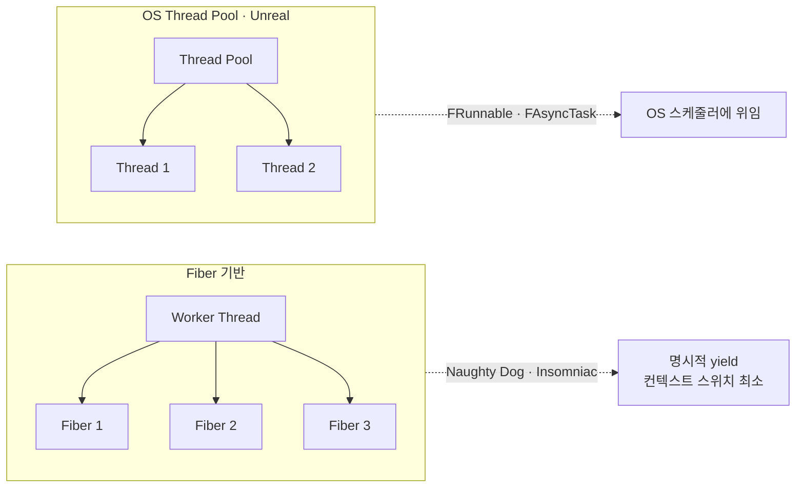

# OS 스케줄링 & 게임 프레임 페이싱

## 개요

게임 엔진은 예측 가능한 프레임 타이밍을 요구한다. OS의 스케줄링 정책(선점형, 선호도, 우선순위)과 VSync, Adaptive Sync 같은 디스플레이 동기화 기술이 교차하면서, 프레임 드랍, 팝, 지터(jitter)가 발생한다. 이를 이해하고 제어하는 것이 부드러운 60/120fps 경험을 만드는 핵심이다.

## 핵심 개념

| 개념 | 설명 |
|------|------|
| **컨텍스트 스위치** | CPU가 한 스레드에서 다른 스레드로 전환. 캐시 플러시, TLB 미스 → ~1000 사이클 오버헤드 |
| **선점형(Preemptive) 스케줄러** | OS가 타임슬라이스 만료 시 강제 전환. 다수 앱 안정성 ↑, 예측성 ↓ |
| **협력형(Cooperative) 스케줄러** | 스레드가 명시적으로 양보(yield). 오버헤드 ↓, 응답성 ↓ |
| **CPU Affinity** | 스레드를 특정 코어에 고정. 캐시 친화성, L3 캐시 일관성 문제 감소 |
| **Thread Priority** | 우선순위 높음 = 더 자주 스케줄. 우선 스레드 우아(starvation) 위험 |
| **VSync / Adaptive Sync** | VSync: 프레임을 모니터 리프레시 신호와 동기(60Hz=16.67ms). G-Sync/FreeSync: GPU 완료 신호에 맞춰 프레임 출력 |
| **Frame Pacing** | 프레임 생성 시점 제어 → 일정한 δt 유지 → 부드러운 애니메이션 |

## 게임 엔진에서의 스케줄링 모델



### Fiber 기반 작업 스케줄링 (Naughty Dog, Insomniac)
Fiber = 경량 스레드. 명시적 yield. 컨텍스트 스위치 오버헤드 최소화. 작업 스틸(work stealing)로 코어 로드 밸런싱.

### Unreal의 thread pool 모델
`FRunnable` 인터페이스 → `FRunnableThread`로 감싸 OS 스레드 풀에 투입. Worker thread들이 우선순위 큐에서 작업 대기.

```cpp
// FRunnable 파생 클래스 정의
class FMyAsyncTask : public FRunnable
{
public:
    virtual bool Init() override { return true; }
    virtual uint32 Run() override 
    {
        // 배경 작업 수행
        FPlatformProcess::Sleep(0.1f);
        return 0;
    }
    virtual void Stop() override {}
};

// 스레드 풀에 등록
(new FAsyncTask<FMyAsyncTask>())->StartBackgroundTask();

// 또는 직접 스레드 생성 + 우선순위 설정
FRunnableThread* Thread = FRunnableThread::Create(
    new FMyAsyncTask(),
    TEXT("MyWorkerThread"),
    0,
    TPri_BelowNormal  // 우선순위
);
```

## Frame Pacing 전략

### 1. VSync 동기화
```cpp
// 엔진 루프
while (bRunning)
{
    float StartTime = FPlatformTime::Seconds();
    
    Tick(DeltaTime);
    Render();
    
    // VSync 활성화 상태에서 GPU는 모니터 신호 때까지 대기
    // (16.67ms @60Hz)
    
    float FrameTime = FPlatformTime::Seconds() - StartTime;
    // FrameTime ~ 16.67ms (정상)
}
```

### 2. Adaptive Sync (G-Sync/FreeSync)
GPU가 프레임 완료 후 즉시 출력 신호 전송 → 프레임 대기 최소화. 단, 모니터/드라이버 지원 필수.

### 3. 명시적 Frame Pacing
```cpp
// 목표 프레임 시간 고정
const float TargetFrameTime = 1.0f / 60.0f; // 60fps
float AccumulatedTime = 0.0f;

while (bRunning)
{
    float FrameStartTime = FPlatformTime::Seconds();
    
    Tick(TargetFrameTime);
    Render();
    
    float FrameEndTime = FPlatformTime::Seconds();
    float ActualFrameTime = FrameEndTime - FrameStartTime;
    
    // 부족한 시간만큼 Sleep
    if (ActualFrameTime < TargetFrameTime)
    {
        FPlatformProcess::Sleep(TargetFrameTime - ActualFrameTime);
    }
}
```

## CPU Affinity & Thread Priority 설정

```cpp
// Windows: CPU Affinity 설정 (스레드를 특정 코어에 고정)
HANDLE hThread = ::GetCurrentThread();
DWORD_PTR AffinityMask = 1ULL << 2;  // CPU 2번 코어만 사용
::SetThreadAffinityMask(hThread, AffinityMask);

// Unreal wrapper
FPlatformProcess::SetThreadAffinityMask(AffinityMask);

// 우선순위 설정
FPlatformProcess::SetThreadPriority(Thread, TPri_High);
// 옵션: TPri_Highest, TPri_AboveNormal, TPri_Normal, TPri_BelowNormal, TPri_Lowest
```

## 심화 학습

- 키워드: Real-time OS scheduling (RTOS), Priority Inversion, Load Balancing
- Unreal Engine: `FTaskGraph`, `FAsyncTask`, Task queue 구조
- 논문: "Scheduling Tasks on Heterogeneous Cores" (NVIDIA GTC talks)
- 관련 페이지: [08-memory-management](../08-memory-management/index.md), [10-profiling](../10-profiling/index.md)
