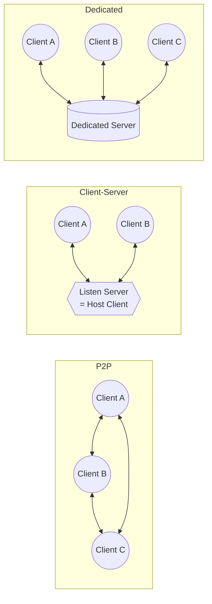
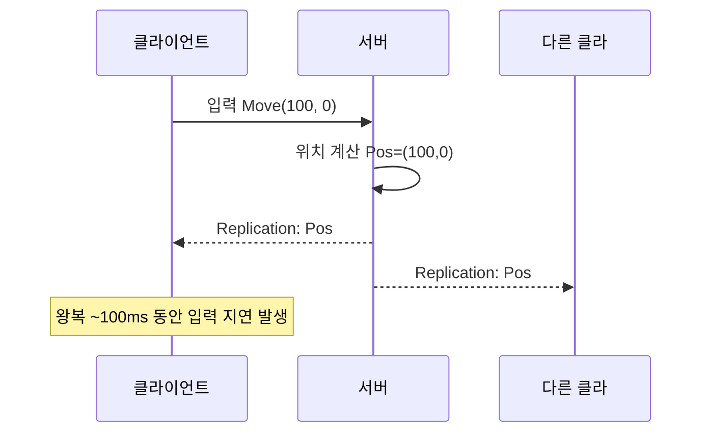

# 게임 네트워킹 동기화

## 개요

멀티플레이 게임은 여러 클라이언트와 서버 사이의 상태 동기화 문제를 풀어야 한다. 네트워크 지연(RTT), 잘못된 패킷(jitter), 손실된 패킷이 불가피하므로, 클라이언트-서버 구조 선택, Authoritative 서버 설계, 클라이언트 예측 및 보정(Client-Side Prediction, Server Reconciliation)이 필수이다. Unreal Engine 5.5+의 Iris Networking은 Push Model 기반으로 이러한 문제를 체계화한다.

## 핵심 개념

| 개념 | 설명 |
|------|------|
| **P2P (Peer-to-Peer)** | 클라이언트들이 직접 통신. 낮은 지연, 높은 보안 위험(치팅), 확장성 제한 |
| **Client-Server** | 모든 상태를 서버 중심 관리. 높은 권한, 지연 증가, 서버 비용↑ |
| **Dedicated Server** | 게임 로직 전담 서버. 클라이언트는 입력만 송신. 높은 신뢰성 |
| **Tick Rate** | 서버 업데이트 빈도 (보통 20/60/120 Hz). 낮을수록 네트워크 트래픽↓, 반응성↓ |
| **RTT (Round Trip Time)** | 클라 송신 → 서버 수신 → 클라 수신. 합산 ~100-300ms (일반 광역망) |
| **Jitter** | RTT 변동. 3개 프레임 중 하나 RTT 급증 → 버퍼링 필요 |
| **Authoritative Server** | 서버만 진실의 원천(source of truth). 클라 입력 검증 후 상태 결정 |
| **Client-Side Prediction** | 클라가 서버 응답 대기 안 하고 로컬 상태 먼저 진행. 입력 느낌 개선 |

## 게임 네트워킹 토폴로지



## Unreal Replication 기초

```cpp
// Actor가 네트워크 복제되도록 설정
AMyCharacter::AMyCharacter()
{
    bReplicates = true;  // 네트워크에서 복제할 액터
    
    // 특정 프로퍼티만 복제
    if (HasAuthority())
    {
        // 서버에서만 위치 설정
        SetActorLocation(FVector(0, 0, 0));
    }
}

// 프로퍼티 복제 등록
void AMyCharacter::GetLifetimeReplicatedProps(TArray<FLifetimeProperty>& OutLifetimeProps) const
{
    Super::GetLifetimeReplicatedProps(OutLifetimeProps);
    
    // 모든 클라에게 복제
    DOREPLIFETIME(AMyCharacter, Health);
    
    // 소유자에게만 복제
    DOREPLIFETIME_CONDITION(AMyCharacter, SecretData, COND_OwnerOnly);
}

// 값 변경 콜백
void AMyCharacter::OnRep_Health()
{
    if (Health <= 0)
    {
        PlayDeathAnimation();
    }
}
```

## 클라이언트-서버 상태 동기화 흐름



**문제**: 서버 응답 대기 중 ~100ms 지연 → 입력이 "뭉개진" 느낌.

## Iris Networking (Unreal 5.5+)

Unreal 5.5부터 기존 Replication을 대체하는 **Iris** 도입:
- **Push Model**: 서버가 변경사항을 주도적으로 푸시
- **데이터-드리븐**: Property 서술(reflection) 자동화
- **대역폭 최적화**: 변경된 필드만 송신

```cpp
// Iris 프로퍼티 선언
UCLASS()
class AMyCharacter : public APawn
{
    GENERATED_BODY()

public:
    AMyCharacter();
    
    // Iris 복제 프로퍼티
    UPROPERTY(Replicated)
    FVector IrisLocation;
    
    UPROPERTY(Replicated)
    float IrisHealth;
};

AMyCharacter::AMyCharacter()
{
    bReplicates = true;
    // Iris 자동 이니셜라이즈 (엔진 자동)
}
```

## 심화 학습

- 키워드: Authoritative Server Validation, Bandwidth Optimization, Replication Graphs
- Unreal: `AGameNetworkManager`, `UNetDriver`, Iris Networking documentation
- 관련 페이지: [client-prediction](./client-prediction.md), [dead-reckoning](./dead-reckoning.md)
