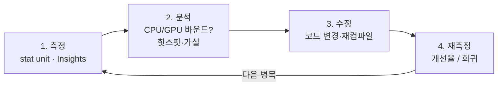

# 게임 프로파일링 & 성능 분석

## 개요

"측정 없는 최적화는 도박이다"는 게임 개발 격언이다. 프레임 드롭이 CPU, GPU, 메모리, 네트워크 중 어디서 발생하는지 알아야만 효과적인 최적화가 가능하다. Unreal Insights, stat 명령, RenderDoc, PIX, Tracy, Superluminal 같은 프로파일링 도구들이 각각 다른 영역을 조명한다. 효과적인 프로파일링 워크플로우는 가설 수립 → 측정 → 검증의 사이클이다.

## 핵심 도구

| 도구 | 대상 | 특징 |
|------|------|------|
| **Unreal Insights** | CPU/GPU/메모리 타임라인 | 엔진 통합, frame graph, 병목 시각화 |
| **stat 명령** | 즉시 수치 | `stat unit`, `stat scenerendering`, 낮은 오버헤드 |
| **RenderDoc** | 프레임 캡처/드로우콜 분석 | DX11/12, Vulkan, 셰이더 디버깅 |
| **PIX for Windows** | GPU 타임라인 (DX12) | CPU-GPU 연동 분석 |
| **Tracy** | 가벼운 in-process 프로파일러 | 낮은 오버헤드, 원격 세션 |
| **Superluminal** | 샘플링 기반 CPU 프로파일러 | 스택 트레이스, 호출 그래프 |
| **Bandicam/FrameView** | FPS/Frametime 그래프 | 빠른 시각화 |

## 프로파일링 워크플로우



가설 → 측정 → 수정 → 재측정 사이클. "예측 기반 최적화" 금지.

## Unreal Insights (Timing 분석)

화면은 크게 세 영역으로 구성된다.

| 영역 | 보여주는 것 |
| --- | --- |
| **Frame Graph** | 프레임 단위 요약 |
| **CPU/GPU 타임라인** | 스레드별 작업 분포·병렬 실행 |
| **콜 트리 / 이벤트 스택** | 함수별 시간, 핫스팟 추적 |

사용 흐름:

```text
1. stat startfile [filename]
2. Play (수 초 ~ 수십 초 기록)
3. stat stopfile
4. Unreal Insights → Open [file]
```

## stat 명령 빠른 참조

```
# 총 프레임 타임
stat unit

# 렌더링 상세 (DrawCalls, Triangles, 셰이더 시간)
stat scenerendering

# 메모리 사용량
stat memory

# 물리 시뮬레이션
stat physics

# 게임 로직
stat game

# 네트워크
stat net

# 커스텀 카운터 (게임 코드에서 측정)
DECLARE_CYCLE_STAT(TEXT("MyFunction"), STAT_MyFunction, STATGROUP_Game);
{
    SCOPE_CYCLE_COUNTER(STAT_MyFunction);
    // 측정할 코드
}
```

## RenderDoc: 프레임 캡처 & 분석

```
워크플로우:
1. RenderDoc 실행 → Unreal 프로세스 연결
2. 문제 프레임 캡처 (Ctrl+Home)
3. Drawcall list: 어떤 드로우콜이 느린지?
4. Texture/Buffer inspector: 리소스 크기 확인
5. Shader editor: 픽셀 셰이더 성능 분석

예시 (텍스처 과다 사용):
  ├─ Drawcall 1000개 보임
  ├─ 각 drawcall 리소스: 4x4K 텍스처
  ├─ 합: 64MB 대역폭/프레임
  └─ 가설: Texture Streaming 미활성화
```

## C++ 커스텀 프로파일링

```cpp
// 범위 기반 측정
{
    SCOPE_CYCLE_COUNTER(STAT_MyHeavyFunction);
    // 코드
    // 벗어날 때 자동 기록
}

// 프레임 단위 카운터
DECLARE_DWORD_COUNTER_STAT(TEXT("Enemies Spawned"), STAT_EnemiesSpawned, STATGROUP_Game);
INC_DWORD_STAT(STAT_EnemiesSpawned);

// 조건부 프로파일링 (개발 빌드에서만)
#if UE_BUILD_DEBUG || UE_BUILD_DEVELOPMENT
    SCOPE_CYCLE_COUNTER(STAT_DebugOnly);
#endif

// 결과 출력
STAT_DECLARE_STAT_UNIT(TEXT("Frame Time"), STAT_FrameTime, STATGROUP_Game);
SET_CYCLE_COUNTER(STAT_FrameTime, FrameTimeMs);
```

## GPU vs CPU 바운드 판단

```
CPU 바운드 신호:
  - GPU 유휴 (GPU time << Frame time)
  - stat unit: Game+Engine > Rendering
  - 객체 많음, 루프 복잡
  
GPU 바운드 신호:
  - Rendering time ≈ Frame time
  - Draw call 많음 (>1000)
  - 화면 해상도 높임 → 느려짐

예시 분석:
  stat unit:
    Frame: 16.5ms (60fps 약간 미만)
    Game:  3ms
    Draw:  2ms
    GPU:   14ms
    
  → GPU 바운드! 렌더링 최적화 우선.
```

## PIX for Windows (DX12)

```
기능:
  - CPU-GPU 타임라인 정렬
  - Drawcall 마다 GPU 시간 측정
  - Memory 대역폭 분석
  - Power consumption (노트북)

사용:
  Unreal: -DX12 포함 빌드
  PIX: 프로세스 연결 → 프레임 캡처
```

## Tracy 통합 (가벼운 프로파일러)

```cpp
// Tracy 초기화 (선택)
#include "Tracy.hpp"

void MyGameFunction()
{
    ZoneScoped;  // 함수 진입 시 자동 측정
    
    DoHeavyWork();
    
    // 명시적 영역
    {
        ZoneScopedN("DetailedWork");
        SpecificOperation();
    }
}

// 결과: Tracy 클라이언트로 시각화 (원격)
```

## 프로파일링 체크리스트

```
프레임 드롭 발생 시:
[ ] stat unit로 프레임 타임 확인
[ ] CPU vs GPU 바운드 판단
[ ] Insights 캡처 → 타임라인 분석
[ ] 핫스팟 함수 식별
[ ] Draw call 개수 확인 (stat scenerendering)
[ ] 메모리 사용량 확인 (stat memory)
[ ] 피크 vs 평균 분리 (1회 스파이크 vs 지속적 병목)
[ ] 가설 수립 & 코드 수정
[ ] 재측정으로 개선율 검증
```

## 심화 학습

- 키워드: Profiling Overhead Compensation, Sampling vs Instrumentation, Real-Time Analysis
- Unreal: `FPlatformProcess::GetCycleCount()`, `GFrameCounter`
- 도서 추천 불가 (사용자 명시적 제외)
- 관련 페이지: [07-os-scheduling](../07-os-scheduling/index.md), [08-memory-management](../08-memory-management/index.md)
