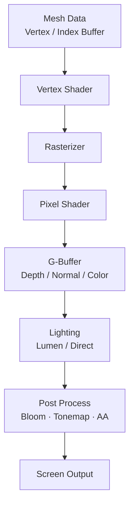

# 11. 물리·렌더링 심화

## 개요

게임의 시각적 품질과 현실감은 고급 렌더링 기법과 정확한 물리 시뮬레이션의 결합에서 나온다.
물리 엔진(PhysX, Chaos)의 경직체 동역학과 제약 솔버, PBR의 에너지 보존 원리, 절차적 생성(WFC)은 현대 게임의 필수 지식이다.

## 이 섹션에서 다루는 것

| 주제 | 핵심 |
| --- | --- |
| [물리 엔진 심화](physics-engine.md) | 경직체 동역학, PhysX vs Chaos, 제약 솔버, CCD |
| [PBR](pbr.md) | Cook-Torrance BRDF, 에너지 보존, Metallic/Roughness |
| [WFC 알고리즘](wfc.md) | Wave Function Collapse 절차적 생성 |

## 물리 → 렌더 파이프라인

게임 스레드에서 물리 결과를 받아 렌더 스레드가 model matrix와 머티리얼 파라미터를 갱신.

## 렌더링 파이프라인 개요

## 핵심 성능 지표 (참고치)

| 항목 | 목표 (60fps 기준) |
| --- | --- |
| **물리 시뮬레이션** | 프레임의 ~25% 이하 (약 4ms) |
| **Draw Call** | 모던 GPU에서 수천 단위 가능. Nanite 사용 시 더 큼 |
| **셰이더 시간** | 픽셀 셰이더가 GPU 시간 대다수면 pixel bound |
| **메모리 대역폭** | 텍스처·MRT가 주요 소비처 |

## 면접/실무 포인트

- **Q1**: 물리와 렌더링을 분리해 다른 주기로 돌릴 수 있나? — 가능. 물리 60Hz + 렌더 120Hz는 시각 보간 필요. UE Chaos는 sub-step + 보간 옵션 제공.
- **Q2**: PBR이 성능에 미치는 영향? — 셰이더 자체 비용은 모던 GPU에서 무시할 수준. 다만 텍스처(BaseColor/Normal/MRA) 대역폭 증가가 진짜 비용 — 압축 포맷 필수.
- **Q3**: WFC를 런타임에 쓸 수 있는가? — 작은 크기는 가능. 큰 맵은 사전 생성 후 패치 단위 갱신이 일반적. Backtracking 비용을 통제하기 어려움.

## 심화 학습

- Visibility Buffer (Nanite의 기반)
- Differentiable Rendering (역방향 학습)
- Compute-based culling
- 관련 페이지: [Draw Call](../04-computer-architecture/draw-call.md), [캐시 메모리](../03-cache-memory/index.md), [공간 분할](../01-data-structures/space-partitioning.md)
