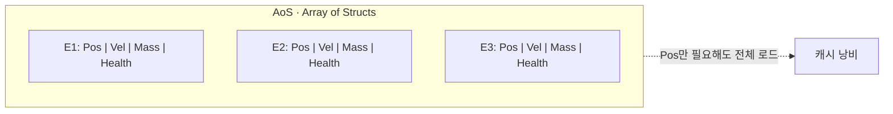
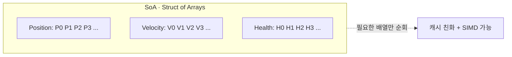
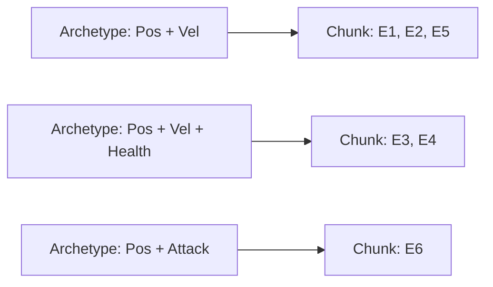
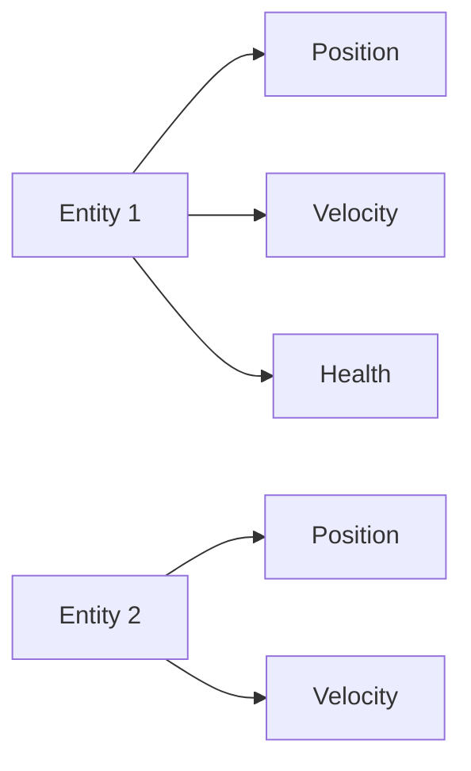
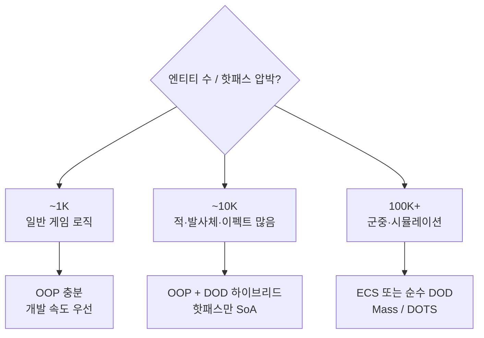

# OOP vs DOD vs ECS

## 개요

게임 아키텍처는 세 가지 패러다임의 선택지를 제공한다. **OOP(Object-Oriented Programming)**는 상속과 캡슐화 중심으로, 직관적이지만 캐시 미스와 런타임 다형성 비용을 초래한다. **DOD(Data-Oriented Design)**는 데이터 레이아웃 우선으로, 캐시 친화적이고 성능 좋지만 코드 구조화 어렵다. **ECS(Entity Component System)**는 조합 가능한 컴포넌트로 유연성과 성능을 동시에 추구한다. 각 패러다임의 트레이드오프를 이해하고 프로젝트 요구사항에 맞춰 선택하는 것이 핵심이다.

## 세 패러다임 비교

| 특성 | OOP | DOD | ECS |
| --- | --- | --- | --- |
| 데이터 구조 | AoS | SoA | 컴포넌트 단위 SoA |
| 캐시 효율 | 낮음 | 높음 | 높음 |
| 상속/다형성 | 강함 | 약함 | 조합으로 대체 |
| 개발 속도 | 빠름 | 느림 | 중간 |
| 확장성 | 중간 | 높음 | 높음 |
| 메모리 사용 | 높음 | 낮음 | 낮음 |
| 엔티티 수 | ~10K | ~100K+ | ~1M+ |
| 성능 특성 | CPU 바운드 | 캐시 최적 | 대량 병렬화 |

## OOP 패러다임

```cpp
class Entity
{
public:
    virtual void Update(float DeltaTime) {}
    virtual void Render() {}
    
protected:
    FVector Position;
    FVector Velocity;
    float Mass;
};

class Character : public Entity
{
public:
    void Update(float DeltaTime) override
    {
        Position += Velocity * DeltaTime;  // 가상 함수 호출
        Health -= 1.0f;
    }
    
private:
    float Health;
    FString Name;
};

// 사용
TArray<Entity*> Entities;
for (Entity* E : Entities)
{
    E->Update(DeltaTime);  // 동적 디스패치 (vptr 추적)
}
```

**장점**:
- 직관적인 설계
- 쉬운 기능 추가 (상속)
- 캡슐화

**단점**:
- 가상 함수 호출 오버헤드 (분기 예측 실패)
- 메모리 단편화 (포인터 추적)
- 캐시 미스 (SoA vs AoS)



## DOD 패러다임

```cpp
struct Position { FVector Value; };
struct Velocity { FVector Value; };
struct Health { float Value; };

// 데이터 저장 (SoA, Structure of Arrays)
struct GameState
{
    TArray<FVector> Positions;      // [P0, P1, P2, ...]
    TArray<FVector> Velocities;     // [V0, V1, V2, ...]
    TArray<float> Healths;          // [H0, H1, H2, ...]
    TArray<int32> EntityIDs;        // ID 연결
};

// Update 루프
void UpdatePositions(GameState& State, float DeltaTime)
{
    // Position만 반복 접근 → 캐시 연속성 극대
    for (int32 i = 0; i < State.Positions.Num(); ++i)
    {
        State.Positions[i] += State.Velocities[i] * DeltaTime;
    }
}
```

**장점**:
- 캐시 효율성 극대
- 벡터화(SIMD) 용이
- 메모리 사용량 적음
- 대규모 엔티티 처리 가능

**단점**:
- 데이터 로직 분산
- 엔티티 추적 어려움
- 버그 위험 증가



## ECS 패러다임

```cpp
// Entity: ID
using EntityID = uint32;

// Component: 데이터만
struct PositionComponent { FVector Value; };
struct VelocityComponent { FVector Value; };
struct HealthComponent { float Value; };

// System: 로직
class MovementSystem
{
public:
    void Update(float DeltaTime)
    {
        // 모든 Position + Velocity 엔티티 반복
        for (const auto& Entity : GetEntitiesWithComponents<PositionComponent, VelocityComponent>())
        {
            auto& Pos = GetComponent<PositionComponent>(Entity);
            auto& Vel = GetComponent<VelocityComponent>(Entity);
            
            Pos.Value += Vel.Value * DeltaTime;
        }
    }
};

// 사용
ECSWorld World;
EntityID Hero = World.CreateEntity();
World.AddComponent<PositionComponent>(Hero, {100, 200, 0});
World.AddComponent<VelocityComponent>(Hero, {50, 0, 0});

MovementSystem MoveSys;
MoveSys.Update(16.0f / 1000.0f);
```

**장점**:
- 유연한 조합 (다양한 엔티티 타입)
- DOD 데이터 레이아웃 활용
- 시스템 재사용성
- 확장 용이

**단점**:
- 러닝커브 가파름
- 캐시 활용은 구현에 의존
- 아키타입 메모리 관리 복잡

## 아키타입 vs 스파스 셋

### 아키타입 (Archetype, Dense)



- 장점: 같은 구성 엔티티가 연속 저장 → 시스템 순회 시 캐시 친화
- 단점: 컴포넌트 추가/제거 시 다른 아키타입으로 이주(재배치)

### 스파스 셋 (Sparse Set)



- 장점: 컴포넌트 추가/제거 O(1), 구조 변경 비용 작음
- 단점: 컴포넌트별 풀로 흩어져 캐시 친화도 낮을 수 있음

## 게임엔진 구현 사례

| 엔진 | 패러다임 | 상세 |
|------|---------|------|
| **Unreal** | OOP (주) + DOD (선택) | Actor/Component 기반. IrisNetworking는 데이터 중심 |
| **Unity DOTS** | ECS (선택) | Entities + Burst + Jobs. 고성능 경로 |
| **Godot** | OOP (주) | Node 트리, 스크립트 중심 |
| **Bevy (Rust)** | ECS | 기본 구조. Rust 소유권 + ECS 시너지 |

## 언제 어떤 것을 쓸까?



## 면접/실무 포인트

- **Q1**: "우리 게임이 10K 엔티티에서 프레임 드롭"?
  - OOP라면 → ECS/DOD로 마이그레이션 고려.
  - 가상 함수 호출 주범일 가능성 높음.

- **Q2**: OOP 상속 vs ECS 조합, 어느 게 더 모듈화?
  - 작은 기능: OOP.
  - 조합 많음: ECS (깊은 상속 피함).

- **Q3**: "DOD로 짜니 버그가 많다"?
  - 데이터와 로직 분산 → 추적 어려움.
  - 테스트 커버리지↑, 타입 시스템↑ (Rust 추천).

## 심화 학습

- 키워드: Cache Locality, SIMD Optimization, Type Erasure
- Unreal: `FVector` SIMD 구현, `FObjectIterator` vs 커스텀 루프
- 관련 페이지: [10-profiling](../10-profiling/index.md), [senior-knowledge](../senior-knowledge/index.md)
