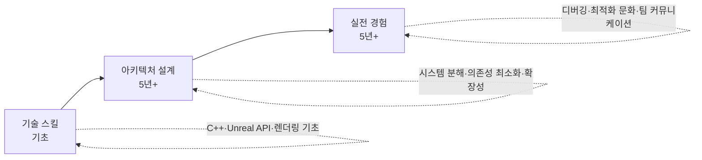

# 시니어 게임 프로그래머 필수 지식

## 개요

5년 이상의 게임 개발 경험을 갖춘 개발자는 기술 스킬을 넘어 **문제 해결 마인드셋**, **코드 리뷰 감각**, **설계 패턴 응용**, **개발 워크플로우 최적화**, **기술 트렌드 감지** 능력을 갖춰야 한다. 이 섹션은 경력이 늘어나면서 자동으로 습득되는 암묵적 지식을 명시적으로 정리한 가이드이다.

## 핵심 역량

## 섹션 구성

각 페이지는 독립적으로 읽을 수 있으며, 실무에서 즉시 적용 가능한 내용이다.

- **[1. 디버깅 마인드셋](debugging-mindset.md)**

    가설-검증, 재현성 확보, crash dump 분석, race·heisenbug 다루기

- **[2. 코드 리뷰 관점](code-review.md)**

    리뷰어의 톤, 게임 코드 체크리스트, Lyra 패턴, 네트워크 안전성

- **[3. 게임 디자인 패턴](design-patterns.md)**

    Object Pool, Component, State, Observer, Service Locator, Command, Flyweight

- **[4. Git & 협업 워크플로우](git-workflow.md)**

    Trunk-based vs Git Flow, PR 사이즈, 모노레포, LFS/Perforce, CI/CD

- **[5. 최신 트렌드 2026](tech-trends-2026.md)**

    Nanite·Lumen, Mesh Shader, Iris, ECS, DirectStorage, GameFeatures

## 정독 순서 추천

1. **디버깅 마인드셋** (기초, 일상적 스킬)
2. **코드 리뷰 관점** (팀 협업)
3. **디자인 패턴** (아키텍처)
4. **Git 워크플로우** (프로세스)
5. **최신 트렌드 2026** (미래 준비)

또는 현재 프로젝트 상황에 맞춰 필요한 것부터 읽어도 된다.
