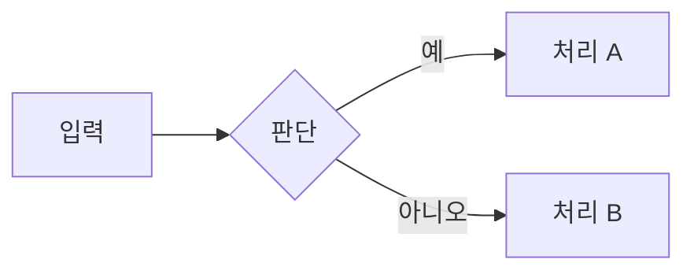

# {{TITLE}}

## 개요

여기에 한 문단으로 이 주제가 무엇이고 어디에 쓰이는지 설명한다.

## 핵심 개념

| 용어 | 정의 |
| --- | --- |
| **용어 A** | 설명 |
| **용어 B** | 설명 |

필요하면 mermaid 다이어그램.



## C++ 예시

```cpp
// Unreal 친화. 15~30줄.
// 예: TArray, FVector, U/F-prefixed 타입 사용.
void Example()
{
    TArray<int32> Values;
    Values.Reserve(100);
    for (int32 i = 0; i < 100; ++i)
    {
        Values.Add(i);
    }
}
```

코드에 한 줄 설명.

## 심화 학습

- 키워드: ...
- 관련 페이지: `[표시명](../section/page.md)` 형식으로 추가
